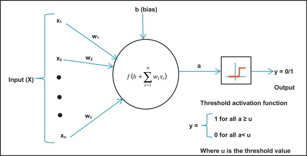
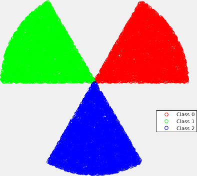

Read The Report for more details.

# Task 1: Perceptron Model for Binary Classes Classification

We have implemented perceptron model for binary classes classification. This perceptron takes 2D points as input and classifies it as belonging to either class 0 or 1. Perceptron model build in these steps:

1.	Parameters Initialization

2.	Model Training:

        a.	Multiplication of weights and input data

        b.	Weight updating (gradient descent)
        

### Steps:
        -Parameters Initialization
        -Model Training
        -Estimated line can correctly classify might not agree with the ground-truth boundary
        -Sometimes boundary oscillating between two solutions and not reaching 100% accuracy
        -Number of epochs required to converge in for both the original and the modified algorithm
     
# Task 2: Perceptron Model for 3-Classes Classification
We implemented perceptron model on 3 classes classification, the dataset points plot shown below, where different colors represent different classes.

We chose one vs All classification approach to solve this problem as in perceptron model can distinguish between 2 classes at one time, so we have set one class true and other 2 classes false at given instant.
### Steps:
        -Implemention Details
        -Modified Accuracy over time
        -Visualize the decision boundaries
        -Linear classifier is still a good choice for this dataset
        
# Task 3: 3-Layer Neural Network like XOR Gate
We have made a 3-Layer Neural Network to classify the non-linearly separable outputs like XOR gate. Neural Network build in these steps:
        
        3.	Define the neural network structure ( # of input units,  # of hidden units, etc). 
        4.	Initialize the model's parameters
        5.	Loop:
                a.	Implement forward propagation
                b.	Compute loss
                c.	Implement backward propagation to get the gradients
                d.	Update parameters (gradient descent)

### Steps:
        -Neural Network Structure
        -Initialize the model's parameters
        -Forward Propagation
        -Compute loss
        -Backward Propagation
        -Minimum number of neurons needed in the hidden layer for successful training
        -When there are too many neurons in the hidden layer
        

